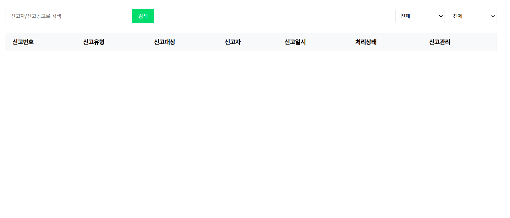

# temp

# 취업을 원하는 청년들을 위한 <br>간편한 일자리 체험 프로그램, 템프.

## 1. 기획 의도


15~29세 청년층의 실업률을 의미하는 <strong>청년실업률</strong>은 2000년 기준 <strong>8.1%</strong>로, 전체 실업률(4.4%)보다 <strong>3.7%포인트나 높았다.</strong><br>
청년들이 실업의 원인으로 꼽은 요소는 다양했지만, 특히 <strong>인턴십, 실무 경험 등 <u>실질적인 경험 기회의 부족</u></strong>이 가장 큰 걸림돌로 나타났다.<br>
이러한 문제를 해결하고자, 청년들이 <strong>쉽게 다양한 취업 프로그램을 찾아보고 참여할 수 있는</strong> 환경이 필요하다고 느꼈다.<br>
이에 따라 <strong>청년 취업을 위한 맞춤형 플랫폼</strong>을 기획하게 되었으며, 이 플랫폼은 <strong>경험 부족을 해소하고 실질적인 취업 기회로 연결</strong>될 수 있도록 다양한 프로그램 정보를 소개하고, 직접 신청 및 참여까지 가능하도록 구성했다.

## 2. 기대 효과


실무경험을 통해 역량을 상승시키고 기업을 위한 인재로 성장한다.

분야별로 각 업종과 관련된 체험 프로그램을 한번에 조회할 수 있고,
간편 이력서 기능을 통해 더욱 부담없고 가볍게 체험 프로그램에 신청할 수 있도록 한다.<br>
기업 또한 회사를 위한 인재 양성에 힘쓸 수 있고, 비용적인 리스크 없이 직원 모집에 대한 데이터를 얻을 수 있다.

## 3. 프로젝트 사용 툴

-   Java
-   JavaScript
-   Apache Tomcat
-   ORACLE
-   Spring Boot
-   Visual Studio Code
-   DBeaver
-   Sourcetree
-   git, github
-   JSON
-   Ajax
-   JDK 17.0.10
-   Kakao DEVELOPER API
-   SMTP Gmail API
-   Slack

## 4. ERD


## 5. 담당 업무

#### 5-1 퍼블리싱


▶ 메인 페이지

-   홈 메인

▶ 체험 프로그램

-   체험 프로그램 목록
-   프로그램 상세보기
-   프로그램 기업 상세보기

▶ 공지 및 FAQ

-   공지사항 목록
-   자주 묻는 질문(기업, 개인) 목록
-   공지사항 상세보기
-   자주 묻는 질문 상세보기

▶ 관리자 페이지

-   기업회원 목록
-   개인회원 문의 목록
-   개인회원 문의 답변
-   기업회원 문의 목록
-   기업회원 문의 답변

#### 5-2 서버


▶ 카카오 회원가입 & 로그인

-   KAKAO 로그인 API를 활용하여 회원 조회 및 추가
-   개인회원은 회원 정보 없으면 자동 가입
-   기업회원 최초 가입 시, 개인회원 가입 후 추가 정보 입력 페이지로 이동
-   로그인 성공 시, 세션에 회원 정보 저장 및 유지

▶ 카카오 로그아웃

-   카카오 REST API를 이용한 로그아웃 기능 구현
-   플랫폼 로그아웃 → 카카오 계정 로그아웃 순서로 처리
-   세션에 저장된 회원 정보 삭제
-   로그아웃 완료 후 메인 페이지 또는 로그인 페이지로 리다이렉트

▶ 관리자 로그인

-   관리자는 별도의 관리자 전용 페이지에서 로그인
-   로그인 후 관리자 홈 페이지로 이동

▶ 관리자 페이지: 신고 게시판

-   기업 대상 신고와 프로그램 대상 신고를 각각 별도의 메뉴로 분리
-   최신 신고 목록을 10개 단위로 조회하여 페이지네이션 적용
-   신고자 / 신고 대상자 기준으로 검색 기능 제공
-   신고일자 및 처리 상태 기준 필터 기능 지원 (예: 전체, 보류, 처리중, 처리완료 등)
-   신고 항목 클릭 시 신고 상세 내용을 모달 창으로 표시
-   상세보기에서 처리 상태 변경 가능, DB 즉시 반영 및 자동 새로고침

▶ 기업회원 마이페이지: 기업회원 초대

-   기업 관리자가 기업회원 초대 기능 사용 가능
-   초대 시 '관리자' 또는 '뷰어' 권한 설정 가능
-   Gmail SMTP API를 활용하여 입력받은 주소로 메일 전송
-   초대 링크 클릭 시 토큰 유효성 검증 수행
-   유효시간이 지난 토큰은 자동 만료 처리
-   초대 대상이 개인회원 가입 상태일 경우, 초대 수락과 동시에 기업회원으로 전환

## 6. 트러블 슈팅(오류, 해결)

## 6-1. 퍼블리싱

### 1. 문제

📌 메인 배너 자동 슬라이드가 다른 탭에서 돌아오면 작동하지 않음

<br>
<오류 화면><br>
메인 배너에 4초 간격으로 자동으로 넘어가는 슬라이드 기능을 구현했으나,
정상 동작하던 슬라이드가 브라우저 탭 전환 후 다시 돌아오면 멈추는 현상이 발생.

### 2. 해결

```
document.addEventListener("visibilitychange", () => {
    if (document.visibilityState === "hidden") {
        clearInterval(autoSlideInterval);
    } else {
        autoSlideInterval = setInterval(autoSlide, 4000);
    }
});
```
<완성 코드><br>
🔍document.visibilitychange 이벤트를 활용하여 브라우저 탭 상태를 감지시켰다.<br>

탭을 벗어났을 땐 clearInterval()로 슬라이드 타이머를 정지시키고,<br>
다시 돌아왔을 때 setInterval()을 재실행하여 슬라이드를 재개시켰다.

✔ 자동 실행되는 기능(setInterval)은 탭 비활성화 시 정지되거나 예외 동작이 생길 수 있다.<br>
이를 인식하고 visibilitychange 같은 브라우저 API를 통해 상태 전환 감지 로직을 넣어야한다.<br><br><br><br>

### 1. 문제

📌 마우스를 내비게이션 바로 옮길 때 메뉴가 너무 빨리 꺼져버림

```
memberButton.addEventListener("mouseleave", () => {
    hideDiv(); // 마우스를 떼자마자 바로 창을 숨김
});
```
<문제 코드><br>
헤더의 버튼위에 마우스를 가져다 대면 추가 nav가 뜨게 하려고 했는데, 이 추가된 nav쪽에 마우스를 가져다 대려 하면 창이 바로 꺼져서 선택하기 어렵다는 문제가 발생했다.

<br>
<오류 화면><br>
button과 nav 사이에 약간의 공간이 있으면
마우스가 그 사이를 지나갈 때 바로 창이 꺼지는 문제가 생겼다.

### 2. 해결
```
const checkMouseLeave = () => {
    setTimeout(() => {
        if (!memberButton.matches(":hover") && !memberNav.matches(":hover")) {
            hideDiv(); // 일정 시간 뒤에도 hover가 아니면 창을 닫음
        }
    }, 100); // 100ms 딜레이
};
```
<완성 코드><br>
🔍 `setTimeout()`으로 100ms의 딜레이를 주고, hover 범위를 버튼 말고 추가되는 nav에도 추가했다.<br>

사용자가 조금 천천히 이동해도 자연스럽게 작동된다.

✔ 많은 사이트가 hover 기반 UI에서 setTimeout 또는 setInterval + clearInterval 방식으로
"살짝 기다리는" UX를 구현한다고 한다.<br><br><br><br>

### 1. 문제

📌 카테고리 버튼을 5개 이상 선택할 수 없도록 제어하는 기능이 제대로 작동하지 않음

```
if (buttonCount >= 5) {
    alert("직무는 5개까지 선택 가능합니다.");
}
button.setAttribute("aria-pressed", isPressed ? "false" : "true");
```
<문제 코드><br>
개별 카테고리 버튼을 클릭할 때마다 aria-pressed 값을 토글하면서 선택된 항목 개수 제한을 걸고자 했다.

<br>
<오류 화면><br>
5개 이상 선택 시 alert는 잘 뜨지만,
alert가 떠도 버튼 상태는 계속 바뀌어서 6개 이상 선택이 가능해지는 문제 발생.

### 2. 해결

```
if (!isPressed && buttonCount >= 5) {
                alert("직무는 5개까지 선택 가능합니다");
                return;
            }

            button.setAttribute("aria-pressed", isPressed ? "false" : "true");
        });
    });
```
<완성 코드><br>
🔍버튼이 아직 눌리지 않은 상태에서 5개 이상 선택하려 할 때만 `return`<br>

이렇게 하면 기존에 선택한 버튼을 해제할 수 있고,
새로운 선택만 제한되기 때문에 UX적으로도 자연스럽게 작동된다.

✔ alert는 UI 피드백을 주긴 하지만,
그 자체로 로직 흐름을 막지는 않기 때문에 상태 변경이 계속 일어날 수 있다. 제한된 조건일 땐 로직 실행을 return으로 중단시켜야한다.<br><br><br><br>

### 1. 문제

📌 radio를 클릭해도 스타일이 바뀌지 않음

```
radios.forEach((radio, index) => {
    radio.addEventListener("click", () => {
        resumeBoxes.forEach((box) => {
            box.style.border = "1px solid rgb(228, 228, 228)";
        });

        if (resumeBoxes[index]) {
            resumeBoxes[index].style.border = "1px solid rgb(0, 221, 109)";
        }
    });
});
```
<문제 코드><br>
라디오 버튼을 클릭하면 선택된 항목에 초록색 테두리를 주는 UI를 구성했지만, 연속 클릭 시 아무 반응이 없는 문제가 발생

<br>
<오류 화면><br>
radio를 체크하면 체크한 radio가 있는 박스의 테두리가 초록, 선택 안 한 radio의 박스 테두리가 회색이 되어야 하는데, 다른 radio를 선택해도 스타일이 변경이 없음.

### 2. 해결
```
radios.forEach((radio, index) => {
    radio.addEventListener("change", () => {
        // 모든 resumeBox의 테두리 초기화
        resumeBoxes.forEach((box) => {
            box.style.border = "1px solid rgb(228, 228, 228)"; // 기본 테두리 색으로 초기화
        });

        // 선택된 radio에 해당하는 resumeBox 스타일 변경
        if (resumeBoxes[index]) {
            resumeBoxes[index].style.border = "1px solid rgb(0, 221, 109)"; // 선택된 것 강조
        }
    });
});
```
<완성 코드><br>
🔍 이벤트를 `click` → `change`로 변경하여, 값이 바뀔 때만 동작하도록 수정했다.<br>

✔ click 이벤트는 같은 radio 버튼을 다시 눌러도 이벤트가 발생하지 않는다.
특히 라디오 버튼은 그룹 안에서 이미 선택된 항목을 다시 클릭해도 아무 변화가 없기 때문에 click보다 change 이벤트가 적절함.<br><br><br><br>

### 1. 문제

📌 페이지 하단에 도달했을 때 버튼이 나타나지 않음

```
window.addEventListener("scroll", () => {
    if (
        window.innerHeight + window.scrollTop >=
        document.documentElement.scrollHeight
    ) {
        gotoTopButton.classList.add("show");
    } else {
        gotoTopButton.classList.remove("show");
    }
});
```
<문제 코드><br>
메인 페이지에서 사용자가 스크롤을 끝까지 내리면 "맨 위로" 버튼이 부드럽게 나타나도록 만들고자 했지만, 아무리 스크롤을 내려도 버튼이 보이지 않았다.

<br>
<오류 화면><br>
window.scrollTop이라는 속성을 사용했는데, 아무 동작도 하지 않았다.

### 2. 해결
```
// 스크롤 감지
window.addEventListener("scroll", () => {
    // 페이지 하단에 도달했는지 확인
    if (
        window.innerHeight + window.scrollY >=
        document.documentElement.scrollHeight
    ) {
        gotoTopButton.classList.add("show"); // 애니메이션으로 보이기
    } else {
        gotoTopButton.classList.remove("show"); // 애니메이션으로 숨기기
    }
});
```
<완성 코드><br>
🔍 window.scrollTop을 window.scrollY로 수정했다.<br>

✔ 자바스크립트에서 스크롤 위치를 잡는 속성은 scrollTop, scrollY, offsetTop 등 여러 개가 있어서 헷갈렸는데, 브라우저 창 기준으로 스크롤된 위치를 알기 위해선 `window.scrollY`가 정답이었다.<br>
처음엔 scrollTop이 window에서도 되는 줄 알았지만, 해당 속성은 documentElement나 특정 요소에만 해당된다는 걸 이번에 알게 되었다.<br><br><br><br>

## 6-2. 서버

### 1. 문제

📌 기업회원 회원가입 추가 정보 입력 후, 서브키 테이블이 insert가 되지 않고 sql 에러 발생

```
    <insert id="insert">
        INSERT INTO TBL_MEMBER
        (ID, MEMBER_NAME, MEMBER_EMAIL, MEMBER_PROFILE_PATH)
        VALUES(SEQ_MEMBER.NEXTVAL, #{memberName}, #{memberEmail}, #{memberProfilePath})
    </insert>
    <insert id="insertCompanyMemberAdmin">
        INSERT INTO TBL_COMPANY_MEMBER (ID, COMPANY_ID, COMPANY_MEMBER_AUTHORITY, COMPANY_MEMBER_DEPARTMENT)
        VALUES (#{id}, #{companyId}, '관리자', #{companyMemberDepartment})
    </insert>
```
<잘못된 코드><br>
슈퍼키 테이블인 TBL_MEMBER에 먼저 insert 한 후 서브키 테이블인 TBL_COMPANY_MEMBER에 입력을 하려고 했다. TBL_MEMBER에 입력을 하는 쿼리에 문제가 없어보였으나 기업 회원가입 정보를 입력해도 가입 처리가 안 되었다.

<br>
<오류 화면><br>
이미 insert 된 TBL_MEMBER 테이블에서 이후 id로 member를 조회한 후 그 id를 TBL_COMPANY_MEMBER에 넣으려 했는데 TBL_MEMBER의 정보를 출력하려 해도 계속 id 컬럼이 null로 출력이 되었다.

### 2. 해결

```
    <insert id="insert">
        <selectKey keyProperty="id" order="BEFORE" resultType="long">
            SELECT SEQ_MEMBER.NEXTVAL FROM DUAL
        </selectKey>
        INSERT INTO TBL_MEMBER
        (ID, MEMBER_NAME, MEMBER_EMAIL, MEMBER_PROFILE_PATH)
        VALUES(#{id}, #{memberName}, #{memberEmail}, #{memberProfilePath})
    </insert>
    <insert id="insertCompanyMemberAdmin">
        INSERT INTO TBL_COMPANY_MEMBER (ID, COMPANY_ID, COMPANY_MEMBER_AUTHORITY, COMPANY_MEMBER_DEPARTMENT)
        VALUES (#{id}, #{companyId}, '관리자', #{companyMemberDepartment})
    </insert>
```
<완성 코드><br>
🔍insert 구문에 `selectKey`를 추가하여, INSERT 이후 생성된 키 값을 자동으로 가져올 수 있도록 설정했다.

이렇게 하면 insert 전에 시퀀스를 먼저 실행해서 id 값을 가져오고,
자바 객체 (MemberVO) 안의 id 필드에 자동으로 주입해준다.<br>
이후 서브 테이블에 insert할 때 이 id 값을 그대로 사용할 수 있다.

✔서브키 테이블에 외래키로 들어갈 값을 사용하려면, 슈퍼키의 PK를 먼저 정확히 확보해야 하고,<br>
이를 설정하지 않으면 외래키 제약 조건으로 인해 insert 실패 및 SQL 오류가 발생하게 된다.<br><br><br><br>

### 1. 문제

📌 카카오 로그인 API 연동 중 Redirect URI 오류 발생

```
            String redirectURI = "http://localhost:10000/kakao/login?type=" + type;
            log.info("[KAKAO] redirect_uri: {}", redirectURI);

            connection.setRequestMethod("POST");
            connection.setDoOutput(true);

            stringBuilder.append("grant_type=authorization_code");
            stringBuilder.append("&client_id=87bef4c36fab14d5714ce773bdd6f030");
            stringBuilder.append("&redirect_uri=" + redirectURI);
            stringBuilder.append("&code=" + code);
```
<문제 코드><br>
기업회원과 개인회원 구분을 위해 type=company 또는 type=personal을 파라미터로 추가해 인가 코드를 요청했음.

그러나, 해당 redirectURI가 카카오 디벨로퍼스에 등록되지 않아 토큰 발급 요청 단계에서 오류 발생.

<br>
<오류 화면><br>
오류 내용을 파악하려고 컨트롤러와 서비스에 수많은 log.info()를 사용했지만, 로그는 전혀 출력되지 않음.

### 2. 해결

<br>
<해결 화면><br>
🔍 카카오 디벨로퍼스 콘솔에 쿼리 파라미터가 포함된 URI를 명시적으로 추가 등록함.

-   카카오는 Redirect URI를 정확히 일치해야 허용함
    → 예: http://localhost:10000/kakao/login만 등록한 경우
    ?type=personal이 붙으면 오류 발생 (KOE006)

✔ 다양한 회원 유형 또는 상황별로 URI에 파라미터를 추가하는 경우,
해당 URI들을 모두 디벨로퍼스 콘솔에 등록해야 함.<br><br><br><br>

### 1. 문제

📌 Gmail SMTP를 이용해 메일을 전송하려 했는데, 메일 전송이 제대로 되지 않는 문제가 생김.

```
  mail:
    host: smtp.gmail.com
    port: 587
    username: luna99954
    password: [내 계정 비밀번호]
    properties:
      mail:
        smtp:
          auth: true
          starttls:
            enable: true
```
<잘못된 설정><br>
입력한 비밀번호가 틀린 건 아니었기에 처음엔 의심하지 못하고 코드만 계속 확인함.

<br>
<오류 화면><br>
Gmail SMTP 서버에 로그인 시도 중 인증 오류 발생.
입력한 자격 증명이 Gmail의 보안 정책에 따라 거부되며, 일반적으로 잘못된 비밀번호나 허용되지 않은 로그인 방식일 때 나타나는 에러라고 함.

### 2. 해결

```
  mail:
    host: smtp.gmail.com
    port: 587
    username: luna99954
    password: aoqe ahek dcnd asom #16자리 앱 비밀번호
    properties:
      mail:
        smtp:
          auth: true
          starttls:
            enable: true
```
<완성 부분><br>
🔍Gmail 계정에서 2단계 인증을 설정하고 앱 비밀번호를 발급받았다. 발급된 16자리 앱 비밀번호를 application.yml에 적용했다.

이렇게 하니 JavaMailSender 테스트 시 정상적으로 메일 전송되었다. SMTP 서버와의 인증 에러도 해결되었다.

✔ Gmail의 보안 정책 강화로 인해 앱 비밀번호를 설정하지 않으면 SMTP 접근 자체가 차단된다고 한다.
<br>
따라서 2단계 인증을 사용하는 계정에서는 반드시 앱 비밀번호를 사용해야 함을 알았다.<br><br><br><br>

### 1. 문제

📌 기업 신고 목록 조회 시 데이터가 출력이 안 됨

```
        // 서버에 요청(fetch)
        console.log("Fetch 시작");
        const response = await fetch(path);

        // 응답 데이터를 JSON 형태로 반환
        const data = await response.json();
        const companyReportListData = data;
        // 콜백 함수가 존재한다면
        if(callback){
            // 데이터를 전달해 실행
            console.log("콜백 실행됨")
            callback(companyReportListData);
        }
    }
```
<문제 코드><br>
REST를 통해 동기적으로 기업 신고목록 데이터를 json의 fetch 형식으로 받고 관리자 화면에 페이지네이션과 띄우려 했음.

fetch를 받는 json 링크에선 데이터 조회가 가능했으나, 화면에 출력이 안 되는 현상 발생.

<br>
<오류 화면><br>
페이지네이션 기능을 확인하던 중, 목록도 페이지네이션도 화면에 아무것도 렌더링되지 않는 문제 발생.<br>
콘솔 에러는 없었고, 콜백 함수는 정상 실행되었기 때문에 렌더링 관련 오류를 쉽게 눈치채기 어려웠음

### 2. 해결

```
        // 서버에 요청(fetch)
        console.log("Fetch 시작");
        const response = await fetch(path);

        // 응답 데이터를 JSON 형태로 반환
        const data = await response.json();
        const companyReportListData = data.companyReports;
        const companyPagination = data.pagination;
        // 콜백 함수가 존재한다면
        if(callback){
            // 데이터를 전달해 실행
            console.log("콜백 실행됨")
            callback(companyReportListData, companyPagination);
        }
    }
```
<해결 코드><br>
🔍 문제의 핵심은 서버로부터 받아온 JSON 응답의 구조를 정확히 파악하지 않고, 전체 응답 객체를 그대로 콜백에 넘겨줬다는 점이었다.

응답 객체를 구조 분해하여`(data.항목)` 원하는 데이터만 꺼내서 콜백에 넘겨주니, 렌더링이 정상적으로 작동했고 페이지네이션 기능도 완전히 복구됨.

✔ 비동기 응답을 사용할 때는 먼저 console.log(data)로 전체 구조를 파악한 뒤,
콜백 함수가 어떤 데이터를 기대하고 있는지 확인하고 그에 맞는 형식으로 필요한 값만 추출해 전달해야 한다.<br>
형식이 조금만 달라도 화면 렌더링이 되지 않을 수 있기 때문에, 응답 구조와 콜백 함수의 기대값을 일치시키는 것이 핵심이라는 걸 실감한 경험이었다.<br><br><br><br>

### 1. 문제

📌 JS로 생성된 버튼에 이벤트가 작동하지 않음

```
// 상세보기 버튼이 js에서 생성된거라 그냥 클래스명으로 선택하려니까 이벤트가 발동안됨..
document.querySelector(".detail-btn").addEventListener("click", (e) => {
        const reportId = e.target.getAttribute("id");  // id 가져오기
        openCompanyReportModal(reportId);  // 모달 열기
});
```
<문제 코드><br>
기업 신고 목록 테이블이 동적으로 렌더링될 때, 각 항목마다 "상세보기" 버튼을 만들고 이벤트를 연결하려 했었다.

하지만 위처럼 .detail-btn 클래스를 직접 선택해서 이벤트를 등록하자 클릭해도 아무 반응이 없었다.
<br><br>

<오류 내용><br>
콘솔 에러도 없고, 버튼도 제대로 보이지만 이벤트가 아예 작동하지 않았다.

### 2. 해결

```
document.querySelector(".detail-btn").addEventListener("click", (e) => {
    // 클릭한 대상이 'detail-btn' 클래스가 있는 버튼인지 확인
    if (e.target && e.target.classList.contains("detail-btn")) {
        const reportId = e.target.getAttribute("id");  // id 가져오기
        openCompanyReportModal(reportId);  // 모달 열기
    }
});
```
<해결 화면><br>
🔍 .detail-btn 버튼이 동적으로 생성되더라도,
부모인 #company-report-table tbody는 처음부터 존재하므로 이벤트를 위임할 수 있다.<br>
그래서 e.target을 기준으로 .detail-btn 클래스가 있는지 확인하여 실행했더니 의도한 대로 코드가 작동했다.

✔ JS에서 동적으로 렌더링되는 DOM 요소는 스크립트 실행 시 존재하지 않기 때문에,
직접 이벤트를 등록하는 방식은 작동하지 않음.

## 7. 느낀 점

### 어려웠던 부분 - 해결

#### 🚀 동적으로 생긴 요소에 이벤트를 추가하는 것

⚠️문제 상황: layout.js에서 fetch를 통해 생긴 동적인 요소들이 document.querySelector를 통해서 선언해도 인식을 못 함

🧠문제 원인: document.querySelector는 DOM에 실제로 존재하는 요소만 찾을 수 있음<br>
그런데 fetch는 비동기적으로 동작하니까, 데이터를 가져오기 전에 querySelector를 실행하면 아직 그 요소는 DOM에 존재하지 않는다.

💡문제 해결: 동적으로 생성된 요소는 fetch 완료 후에 querySelector로 잡거나, 이벤트 위임(callback) 방식으로 처리해야 한다.

---

#### 🔄 REST API 구조의 이해와 사용

⚠️문제 상황: REST API 방식으로 데이터를 주고받는 게 처음이라, 요청 URL을 어떻게 구성해야 하는지부터 어려웠다.

🧠문제 원인: 클라이언트와 서버 간의 통신 방식에 대한 개념이 부족했고, GET, POST, PUT, DELETE 같은 메서드 사용 목적도 혼란스러웠다.

💡문제 해결: 요청 방식에 따라 URL을 명확하게 설계하고, 응답 형태를 JSON으로 맞추면서 점차 익숙해졌다. 실제로 요청과 응답을 주고받아보면서 개념이 정리되었다.

---

#### 🍪 세션과 쿠키의 개념과 사용

⚠️문제 상황: 로그인 상태를 유지하려고 세션과 쿠키를 사용하려 했는데, 값이 제대로 저장되거나 불러와지지 않았다.

🧠문제 원인: 쿠키와 세션의 차이점을 명확히 이해하지 못했고, 저장 위치와 작동 타이밍에 대한 개념이 부족했다. 특히 프론트와 백엔드 간의 요청/응답 흐름을 놓치기 쉬웠다.

💡문제 해결: 브라우저 개발자 도구와 로그를 활용해 저장되는 위치와 값을 추적하면서 개념을 정리했다. 이후 로그인 성공 시 세션에 값을 저장하고, 필요한 페이지에서 제대로 불러올 수 있게 되었다.

## 8. 총평

#### 🧭 기획은 중요하다! 꼼꼼하게 하자

프로젝트 초기에는 기획의 중요성을 크게 실감하지 못했지만, 서버 작업 중에 퍼블리싱 페이지가 완성되지 않아 다시 HTML이나 모달창을 만들어야 했던 상황이 생겼다. 그때 "기획이 곧 구조다"라는 걸 절실히 느꼈고, 앞으로는 퍼블리싱 전에 기획을 더 꼼꼼하게 준비해야겠다는 교훈을 얻었다.

#### 🤝 협업을 하는 이유

이번 팀 프로젝트를 통해 협업이라는 걸 처음 제대로 경험했다. 팀원들과 의견을 나누고, 각자의 페이지를 연결해보며 코드와 기획에서 서로 배울 점이 많다는 걸 느꼈다. 혼자서 만든 플랫폼보다 훨씬 완성도 있는 결과물을 낼 수 있었고, 협업의 장점을 몸소 체감했다.

#### 🛠️ 오류로부터 발전이 있다

Spring Framework, REST API, 다양한 비동기 처리 등 처음 접하는 기술이 많아 많은 오류와 마주해야 했다. 막막함과 좌절도 있었지만, 직접 해결해가며 기능을 하나씩 완성할 때마다 성취감을 느꼈다. 그 과정이 결국 나를 한층 성장시켰다고 느낀다.

#### 📝 내 코드를 남이 볼 거란 생각을 하자

팀원들의 퍼블리싱 페이지를 기반으로 서비스를 구현하거나, 중간에 나간 팀원이 미완성으로 남긴 페이지를 마무리하면서 '다른 사람의 코드를 읽는 일'이 얼마나 어려운지 절감했다. 내가 짠 코드도 누군가 보게 된다는 걸 항상 염두에 두고, 더 깔끔하고 이해하기 쉬운 코드 작성을 목표로 삼게 되었다.

#### 🧩 기능만큼 중요한 연결<br>

이번 프로젝트를 진행하면서 단순히 기능을 구현하는 것만으로는 부족하다는 점을 많이 느꼈다. 각각의 기능이 제 역할을 하더라도, 그 기능들이 서로 자연스럽게 이어지지 않으면 사용자 입장에서는 불편할 수 있다는 걸 실감했다. '기능'만이 아니라, 이 기능들이 모여 하나의 '서비스'가 되어야 한다는 감각이 필요하다는 것을 배웠고, 단순한 구현이 아니라 전체적인 사용자 흐름을 고려하며 개발해야겠다고 다짐하게 되었다.

#### 🖱️ 사용자 입장에서 생각하기<br>

처음에는 기능을 정상적으로 구현하는 데에만 집중하다 보니, 사용자 입장에서 이 기능이 어떻게 보이고 어떻게 느껴지는지는 간과한 부분도 있었다. 하지만 프로젝트를 진행하면서 직접 내 페이지를 사용해보면서 사용자의 입장에서 다시 한 번 기능을 바라보게 되었다. 생각보다 작은 부분들이 사용자 경험에 얼마나 큰 영향을 미치는지 깨달았다. 앞으로는 항상 "내가 이 서비스를 처음 이용하는 사용자라면?"이라는 질문을 스스로에게 던지며 작업을 진행해야겠다는 생각이 들었다.

#### 🚀 성장하는 미래의 나!

막연히 가능할까 싶었던 플랫폼을 직접 구현해냈고, API도 다양하게 사용해보며 실력을 쌓을 수 있었다. 어려운 순간도 많았지만 기능이 오류 없이 작동할 때의 뿌듯함은 말로 다 할 수 없었다. 다음에는 더 나은 기획과 기술로, 더 멋진 결과물을 만들어보고 싶다.
